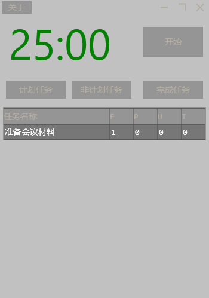

# OstrichPomoadoro

#### 介绍
鸵鸟 番茄钟 关注项目 毛玻璃窗口

#### 基本说明
E（estimated)是预估番茄数

   即“Add New”新建任务时，任务名称右边输入的数字

P（Pomodoros）是实际番茄数

   即已经花在该活动的番茄数，先选择某任务，再“Start Timer”，软件会记录完成的番茄数。

U（unplanned）是“计划外”。

  假设我先建立了一个活动叫“发邮件”，但开始工作时又发现需要先把方案整理好，因此选中“发邮件”活动，点击unplanned，新建“整理方案”活动。这时，“发邮件”活动U区会加1，代表这个活动衍生出计划外活动。

I（interruptions）中断数。

  在番茄计时期间受到干扰，但及时排除的项目。
